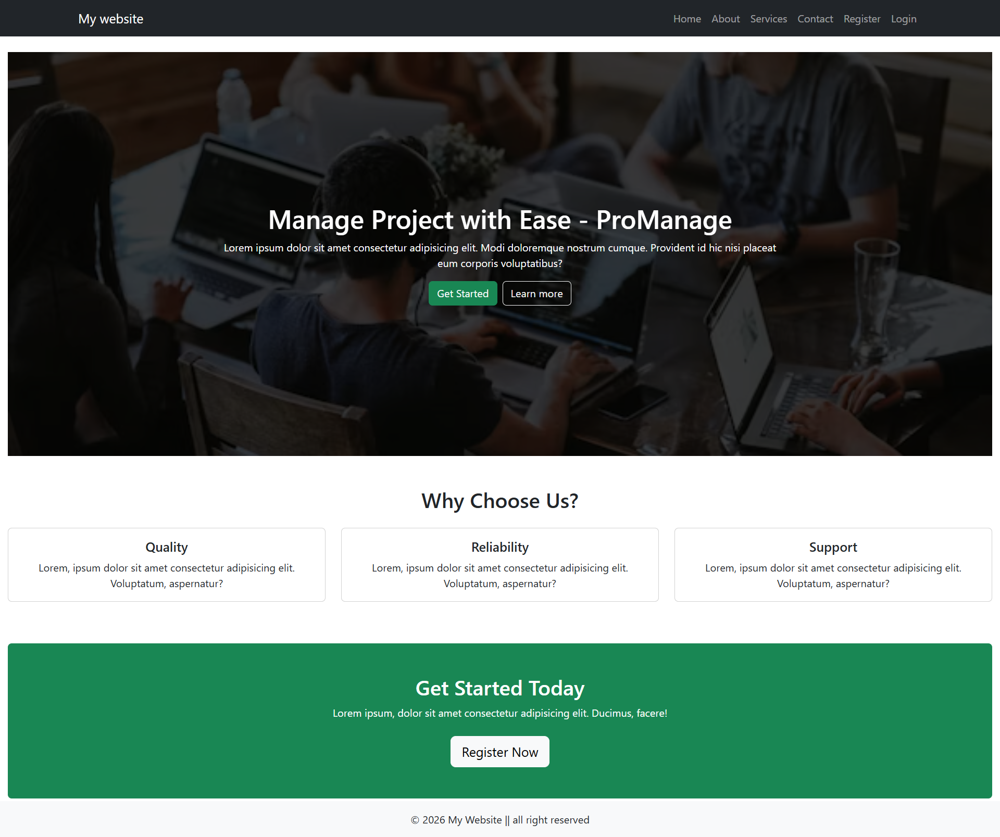
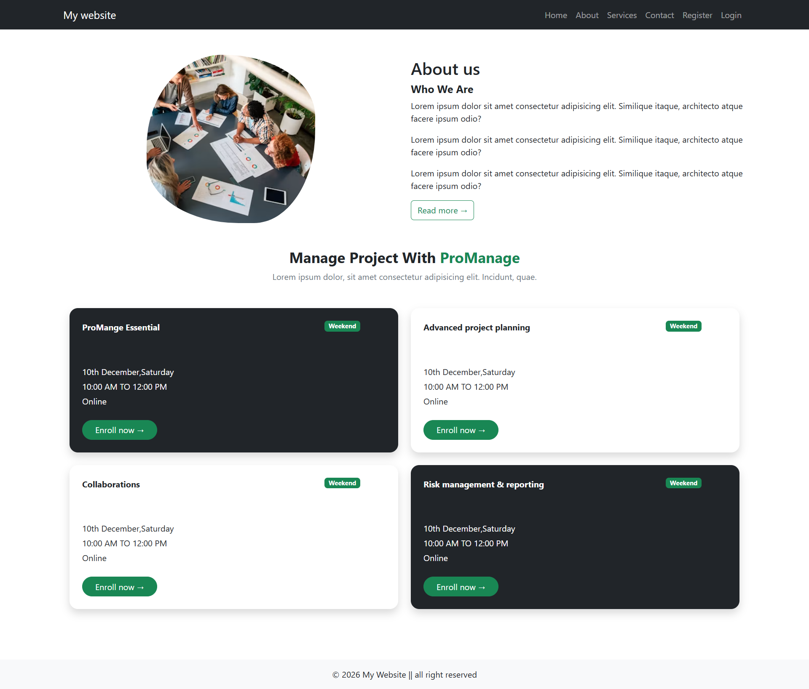
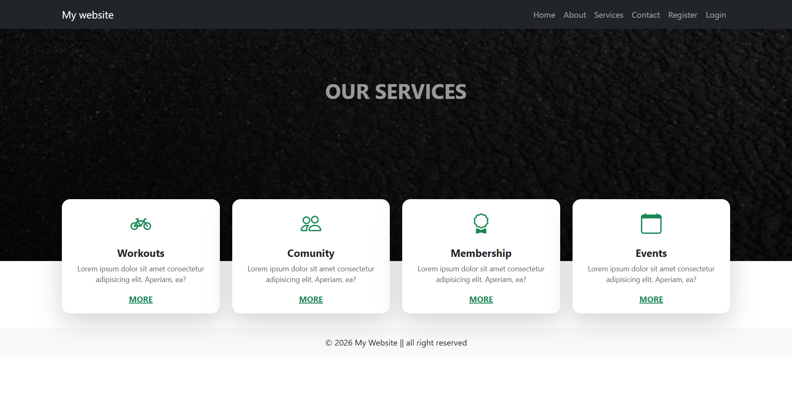
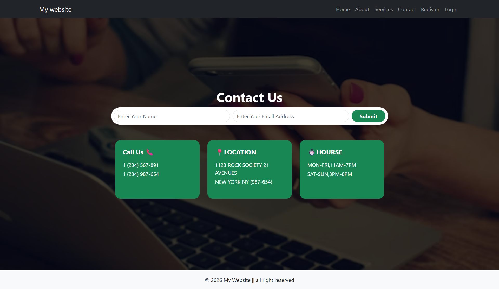
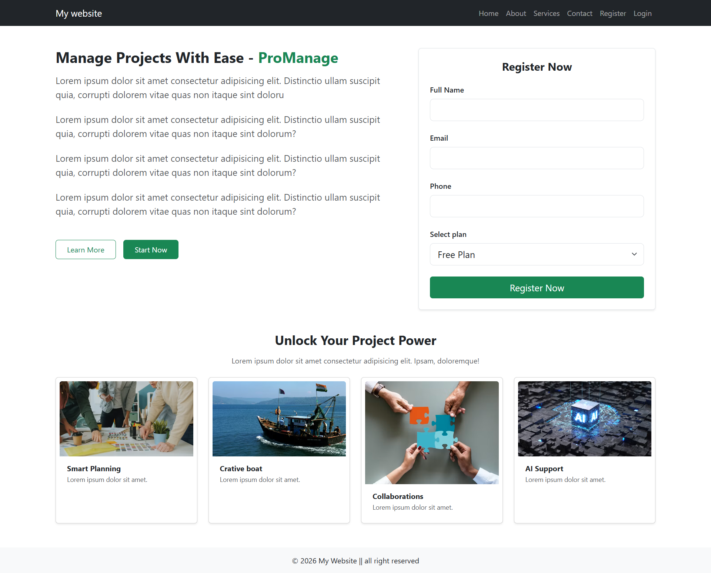
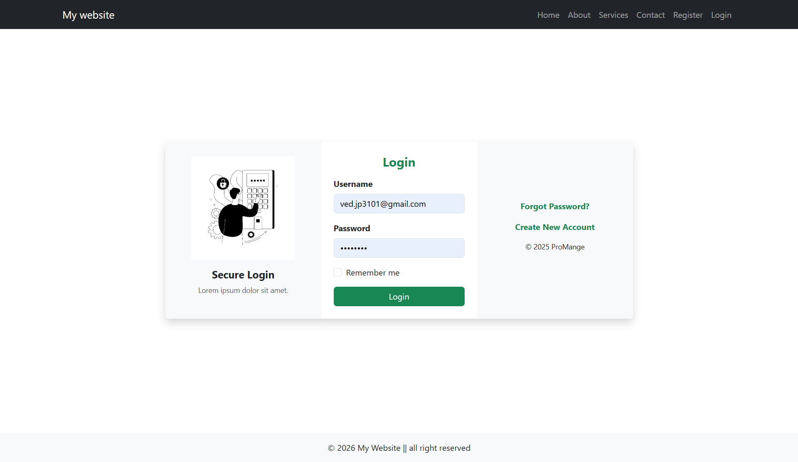

# 🚀 ProManage – React Project Management Website

ProManage is a modern and responsive **Project Management Website** built using **React.js** and **Bootstrap**. The website provides a clean user interface with multiple pages for managing and presenting project-related services.

## 🌐 Live Demo

🔗 **Live Website:** https://promanage-react-website-mu.vercel.app/

## 📂 GitHub Repository

🔗 **Repository:** https://github.com/sakib987447/promanage-react-website


## ✨ Features

* 🏠 Responsive Home Page
* 👤 About Us Page
* 🛠️ Services Page
* 📞 Contact Us Page
* 📝 User Registration Page
* 🔐 Login Page
* 🧭 React Router Navigation
* 📱 Fully Responsive Design
* 🎨 Bootstrap-based UI
* ♻️ Reusable Navbar and Footer Components
* 🖼️ Responsive Images and Cards
* 📋 Project management themed sections

---

## 🛠️ Technologies Used

* **React.js**
* **React Router DOM**
* **Bootstrap 5**
* **JavaScript (ES6+)**
* **HTML5**
* **CSS3**
* **Vite**
* **Unsplash Images**

---

## 📁 Project Structure

```text
promanage-react-website/
│
├── public/
│
├── src/
│   ├── Components/
│   │   ├── Navbar.jsx
│   │   └── Footer.jsx
│   │
│   ├── Pages/
│   │   ├── Home.jsx
│   │   ├── About.jsx
│   │   ├── Services.jsx
│   │   ├── Contact.jsx
│   │   ├── Register.jsx
│   │   └── Login.jsx
│   │
│   ├── Images/
│   │   └── Vector_login.jpg
│   │
│   ├── App.jsx
│   ├── App.css
│   └── index.css
│
├── package.json
├── package-lock.json
└── README.md
```

---

## 🖥️ Website Pages

### 🏠 Home

The Home page contains a hero section, project management introduction, key features, and a call-to-action section.

### 👥 About

The About page provides information about ProManage along with project management programs and enrollment cards.

### 🛠️ Services

The Services page displays different services such as:

* Workouts
* Community
* Membership
* Events

### 📞 Contact

The Contact page includes:

* Contact form
* Phone information
* Location
* Working hours

### 📝 Register

The Registration page contains:

* Full Name
* Email
* Phone
* Plan Selection
* Register button
* Project management feature cards

### 🔐 Login

The Login page includes:

* Username
* Password
* Remember Me
* Login button
* Forgot Password
* Create New Account

---

# 📸 Screenshots

## 🖼️ Website Preview

<table>
  <tr>
    <td align="center">
      
      <br>
      <b>Home Page</b>
    </td>
    <td align="center">
      
      <br>
      <b>About Page</b>
    </td>
    <td align="center">
      
      <br>
      <b>Services Page</b>
    </td>
  </tr>

  <tr>
    <td align="center">
      
      <br>
      <b>Contact Page</b>
    </td>
    <td align="center">
      
      <br>
      <b>Register Page</b>
    </td>
    <td align="center">
      
      <br>
      <b>Login Page</b>
    </td>
  </tr>
</table>


## 📱 Responsive Design

The website is designed to work across different screen sizes:

* 💻 Desktop
* 💻 Laptop
* 📱 Mobile
* 📱 Tablet

Bootstrap's responsive grid system is used to create the responsive layout.

---

## 🔗 Navigation Routes

| Page     | Route       |
| -------- | ----------- |
| Home     | `/`         |
| About    | `/about`    |
| Services | `/services` |
| Contact  | `/contact`  |
| Register | `/register` |
| Login    | `/login`    |

---

## 🎯 Project Purpose

The main purpose of this project is to practice and demonstrate:

* React component development
* React Router
* Bootstrap responsive design
* Reusable components
* Page navigation
* Modern UI development
* React project structure

